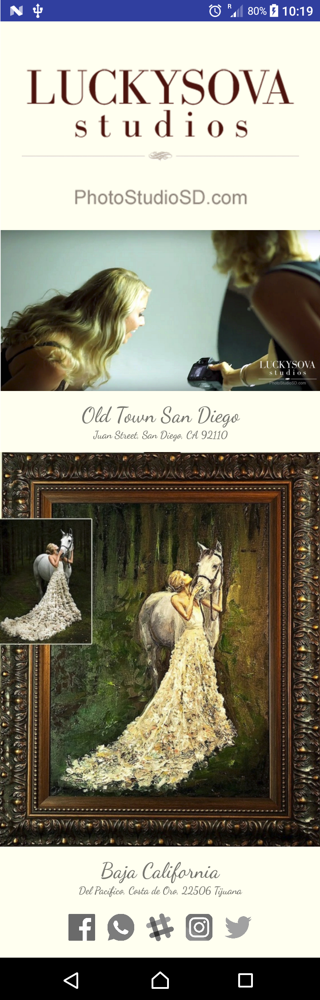

# Luckysova

This is an Android app that displays information about a small business, created as part of the [Android Basics Nanodegree by Google](https://www.udacity.com/course/android-basics-nanodegree-by-google--nd803).

### Skills Demonstrated

- Single screen app using several image resources.
- Button selector that differentiates between pressed and unpressed states.

#### Scrolling view on 720 x 1280p (API 25) in portrait orientation.
#### 
